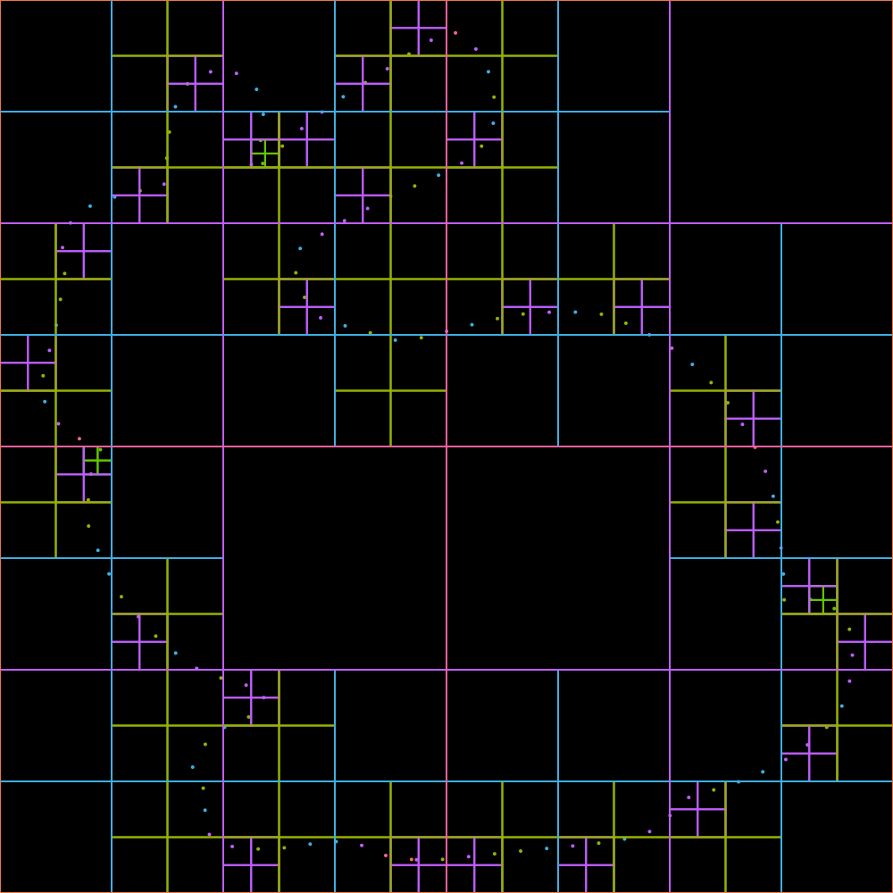
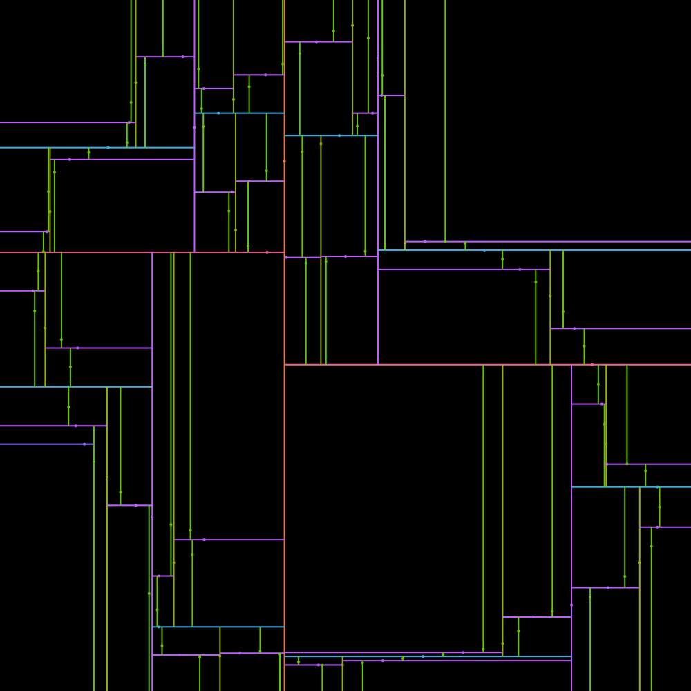

# vptree-draw
[](https://github.com/bfraboni/vptree-draw/actions/workflows/cmake.yml)

SVG export of several 2D space partitioning structures.

## Code structure

- `geo.h` minimalist 2D geometry structures (Point, Vector, Box, Sphere)
- `bvhsphere.h` minimalist bounding sphere hierarchy
- `bvhbox.h` minimalist bounding box hierarchy
- `kdtree.h` minimalist kd tree
- `quadtree.h` minimalist quadtree
- `vptree.h` minimalist vantage points tree
- `bvptree.h` minimalist Bregman Kullback-Leibler vantage points tree
- `draw.h` tree to SVG draw functions 
- `simple_svg_extend.h` extends Simple SVG to support arcs and cavc::PolyLine (aka: bulge paths)

## Dependencies 
(included in this project)
- Simple SVG drawing library [link](https://github.com/adishavit/simple-svg)
- Cavaliers contours [link](https://github.com/jbuckmccready/CavalierContours)

## Build

The project uses [cmake](cmake.org) to build the examples. For
instance (linux/mac):

```
mkdir build
cd build
cmake ..
make
```

**Note**: the `bunny.dat` file must be copied in the same folder as
the build binaries.

## Examples

|VP tree|Quadtree|KD tree|BVH box |BVH sphere|
|:---:|:---:|:---:|:---:|:---:|
|  |  |  |  |  |

|Large poster|
|:---:|
||

## Contributors

Basile Fraboni, LIRIS, INSA Lyon, Université Claude Bernard Lyon 1

David Coeurjolly, CNRS, LIRIS

## License

You may use, distribute and modify this code under the terms of the MIT license. For further details please refer to : https://mit-license.org/
